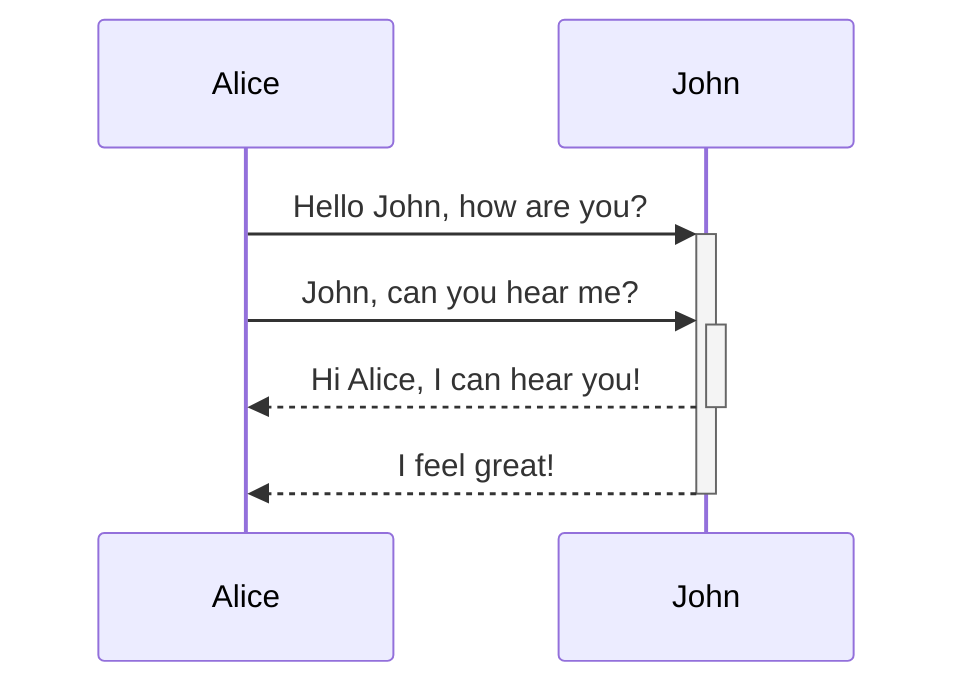

::: mermaid
graph TD;
    A-->B;
    A-->C;
    B-->D;
    C-->D;
:::

以块方式注释，并解释代码，示例：
/**
 * CurrentUser 装饰器
 * 用于从请求上下文中获取当前登录用户信息
 *
 * 实现原理:
 * 1. 使用 createParamDecorator 创建参数装饰器
 * 2. 泛型参数 IAccessTokenPayload 指定返回的用户信息类型
 * 3. 从 ExecutionContext 中获取 HTTP 请求对象
 * 4. 返回请求对象中的 user 属性(由认证中间件注入)
 *
 * 使用示例:
 * @Get('profile')
 * getProfile(@CurrentUser() user: IAccessTokenPayload) {
 *   return user;
 * }
 */